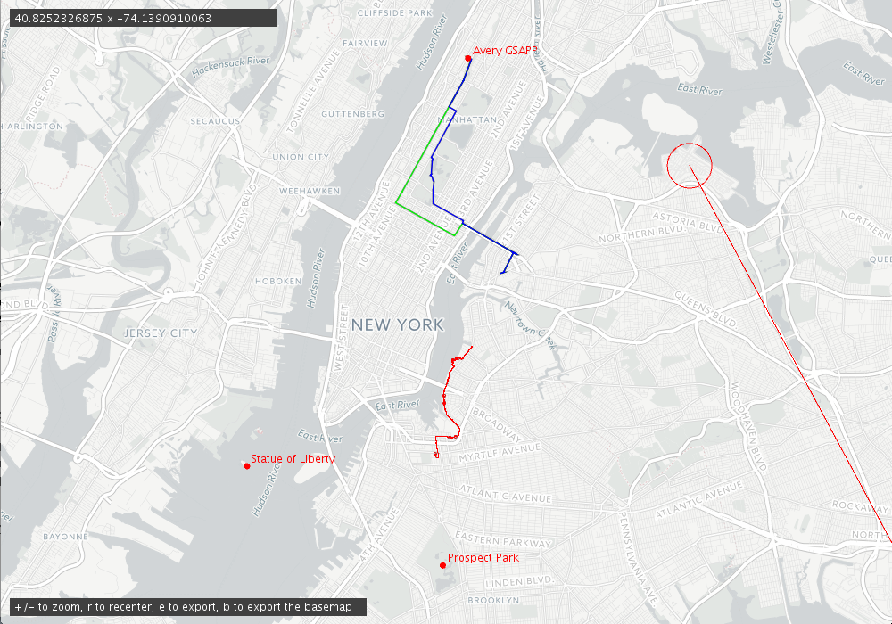

# SlippyMapper

Demo of a library to draw [Slippy Map](http://wiki.openstreetmap.org/wiki/Slippy_Map)-style maps in Processing.py.

The core library just renders maps from tile servers and includes a preselected set of popular public servers.

This example shows several things:

- How to load a tiled map from tile servers
- Building a user interface around such a map for a Slippy-Map-style experience
- Using built-in layering functionality for
  - Drawing markers
  - Rendering KML data
  - Rendering GeoJSON data
  - Rendering Google Directions from the Google Directions API

The library itself does all of these things automatically.

You can do more than just display a single Slippy Map, like drawing several tile maps, exporting the entire layered map or just the base map.
